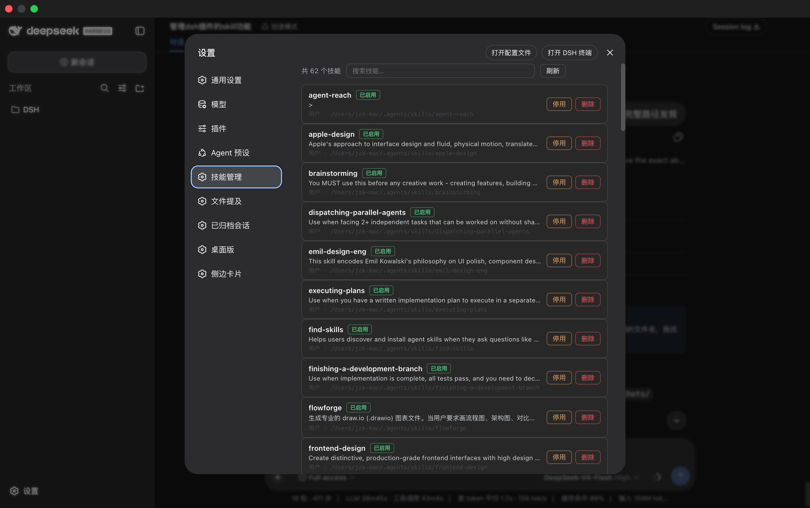

# dsh-skills-manager

> 在 DSH（DeepSeek Harness）的设置面板里**管理已安装的技能**：浏览完整技能目录（不再只有 `/` 命令入口）、搜索、停用/启用（无需卸载重装）、删除进可恢复的回收站。桌面端与 Web 端通用。

DSH 的技能只能在会话输入框用 `/` 命令查看，且没有删除/停用能力。这个插件在设置面板新增「**技能管理**」页，把技能目录变成可管理的列表。

## 截图

<!-- 把截图放到 docs/screenshots/ 后，在下方按 `` 填入 -->


## 功能

- **完整技能列表**：所有已安装技能（名称、描述、来源、位置、状态）一目了然，支持**搜索过滤**——不需要再靠 `/` 命令逐个翻。
- **停用 / 启用**：停用后技能从 `/` 命令列表隐藏，但文件保留，随时可重新启用（无需卸载重装）。
- **删除（回收站）**：删除把技能目录移入 `~/.dsh/.skill-trash/`，可一键恢复，误删不慌。
- **彻底删除**：回收站条目可彻底清除（不可恢复）。
- **内置技能只读**：随应用分发的 bundled 技能标记为只读，不可误删。

同时支持 **DSH Desktop** 与 **`dsh web`**：插件只依赖官方 DSH contract（`typert` / `skills` / `fs` / `shell` / client `remote` / `slots` / `locale`），不涉及任何桌面专用服务。

## 安装

```sh
dsh plugin --profile desktop add @jiangdaoli/dsh-skills-manager   # Desktop
# 或
dsh plugin --profile web add @jiangdaoli/dsh-skills-manager       # web
```

安装后重启 DSH，在 **设置 → 技能管理** 查看。

> **请从 npm 安装**（上方的包名）。GitHub 仓库只包含源码，构建产物（`lib/`）在发布时由 CI 生成，从仓库直接安装会缺文件。从源码安装请先 `pnpm install && pnpm build`。

## 工作原理

| 操作 | 实现 |
| --- | --- |
| 停用 | 重命名 `<技能目录>/SKILL.md` → `SKILL.md.disabled`（技能文件系统 watcher 自动刷新，`/` 列表立即隐藏） |
| 启用 | 反向重命名 |
| 删除 | 移动到 `~/.dsh/.skill-trash/<name>-<ts>/` 并写入 `.json` 记录原始路径 |
| 恢复 | 按记录移回原位置 |
| 彻底删除 | `rm -rf` 回收站条目 |

安全边界：所有变更路径都经过 `fs.resolve` + `fs.contains` 守卫，只允许操作 `~/.dsh/skills`、`~/.agents/skills` 与回收站内的文件；内置（bundled）技能与运行时注册技能只读。

## 开发

```sh
pnpm install
pnpm build     # tsc 类型声明 + esbuild（lib/index.js host + lib/client.js 客户端 bundle）
pnpm typecheck
pnpm node test/core.test.mjs   # 核心逻辑测试（临时目录 + 假 fs/shell）
```

## License

[MIT](LICENSE)
